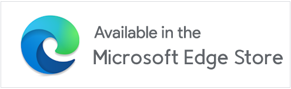

# Companion Window | Always on Top

 

  

  

## 🚀 Overview
The **Companion Window | Always on Top** browser extension transforms any webpage into an always-on-top floating window using Document Picture-in-Picture (PiP) technology. This powerful extension enhances your browsing experience and boosts productivity by enabling true multitasking. Whether you're writing code, conducting research, or engaging with AI assistants, you can keep any webpage visible and accessible while working across different applications or browser tabs.

## ✨ Features
- **Always-on-Top Window**: Keep any webpage visible while working in other tabs or applications
- **Flexible Access**: Open via the toolbar icon, context menu, or keyboard shortcut (Alt+C)
- **Window Controls**: Easily minimize, restore, and refresh your companion windows
- **Customizable Experience**: Toggle context menu and floating button visibility for a cleaner interface

## 🔧 Usage
There are multiple ways to open your current tab in a Companion Window:
1. **Toolbar Icon**: Click the extension icon in your browser toolbar
2. **Context Menu**: Right-click anywhere on the webpage and select "Open in Companion Window"
3. **Keyboard Shortcut**: Press `Alt+C` to open the companion window

## ⚙️ Extension Options
Right-click the extension icon in your browser toolbar and select "⚙️ Options", you have several configuration options:
- **Context Menu Settings**:
  - **In Page**: Enable or disable the right-click context menu option "Open in Companion Window" for web pages
  - **On Link**: Enable or disable the right-click context menu option for opening links directly in Companion Window
- **Floating Button**: Show or hide the floating menu button (three dots) in the top-center of the companion window. This button provides quick access to additional controls like minimizing or refreshing your companion window.
- **Keyboard Shortcuts**: Configure or customize the keyboard shortcut (default: Alt+C). You can change this in your browser's extension shortcuts settings to better fit your workflow.

## 📷 Screenshots
1          |  2
:-------------------------:|:-------------------------:
 | 
3            |  4
 | 
5           |         
 |

## 👥 Contributing
Contributions are welcome! Please feel free to submit a Pull Request. For major changes, please open an issue first to discuss what you would like to change.

## 📄 License
[Companion Window][repo] by [Mohamed Anan][author] is licensed under [Creative Commons Attribution-NonCommercial-NoDerivatives 4.0 International][license] 
<!-- [![CC BY-NC-ND 4.0][cc-by-nc-nd-image]][license] -->
<!-- References -->
[repo]: https://github.com/Mohamed3nan/CompanionWindow
[author]: https://github.com/Mohamed3nan
[license]: https://creativecommons.org/licenses/by-nc-nd/4.0/?ref=chooser-v1
[cc]: https://mirrors.creativecommons.org/presskit/icons/cc.svg?ref=chooser-v1
[by]: https://mirrors.creativecommons.org/presskit/icons/by.svg?ref=chooser-v1
[nc]: https://mirrors.creativecommons.org/presskit/icons/nc.svg?ref=chooser-v1
[nd]: https://mirrors.creativecommons.org/presskit/icons/nd.svg?ref=chooser-v1
[cc-by-nc-nd-image]: https://licensebuttons.net/l/by-nc-nd/4.0/88x31.png
[cc-by-nc-nd-shield]: https://img.shields.io/badge/License-CC%20BY--NC--ND%204.0-lightgrey.svg
